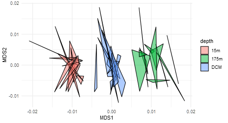

NMDS Shard Plots
================
William Kumler
2/16/2022

## Motivation

NMDS’s are very nice for multidimensional data, but visualizing them can
often be an absolute pain because the `vegan` package doesn’t play
nicely with other plotting libraries and often hides its output in
complicated objects. Nonetheless, we often want to visualize the output
in a friendly way.

Here, I mean “friendly” as in axes of MDS1 and MDS2, colored by some
explanatory environmental factor, and replicates connected together.
This often creates a “shattered” look to the plot so I’ve called them
NMDS shard plots.

## Output

