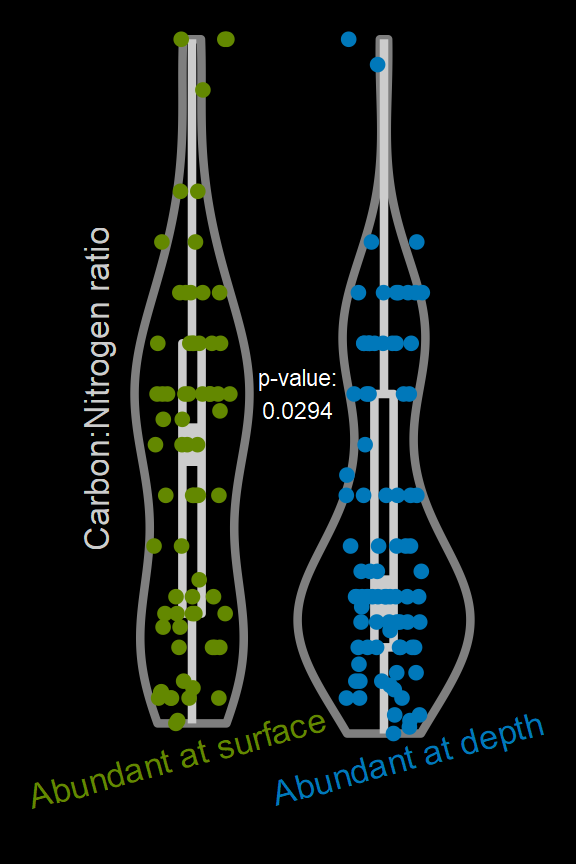

Carbon to nitrogen ratios at two depths
================
William Kumler
4/25/2022

## Motivation

This is a figure that I made for my ARCS poster, presented on May 1st
2022. It’s often difficult to get the data all shaped exactly the way we
want it to and there’s several `tidyverse` tricks that I thought would
be worth documenting.

## Tricks used

-   `dplyr`’s `nest` and `unnest` functions to turn data into a single
    data frame entry
-   `broom`’s `tidy` function, applied rowwise with `dplyr`’s `map`
-   `coin`’s `oneway_test` and `pvalue` for permutational t-test
-   Manual color scales with `scale_color_manual(breaks = , values =)`
-   `ggdark`’s `dark_theme_void`
-   Transparent background for use on the poster’s color gradient
    background

## Data

Data comes from the MESOSCOPE and Falkor cruises. `clean_peaks` contains
output from the modified XCMS pipeline I’ve been using with peak
integration areas and depth info. `feature_formulas` is from later on in
the pipeline where I’ve used isotope envelopes, SIRIUS, and Rdisop to
guess at the molecular formula of various features.

## Output

