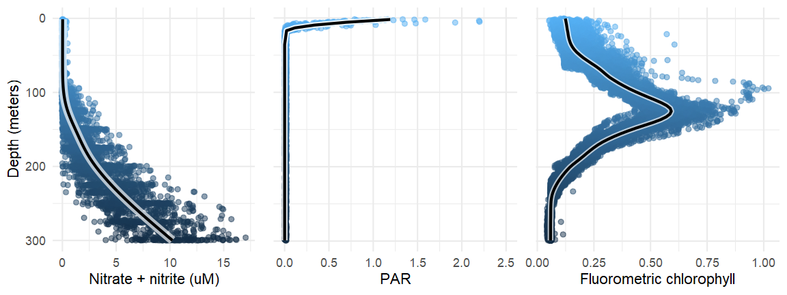

```{r setup, include=FALSE}
knitr::opts_chunk$set(echo = TRUE)
```

## Motivation

I use CMAP and CTD data a lot in my research, but as soon as I take a break from interacting with them I immediately struggle to remember how they work and what formats the data is in. 

## Tricks used

  - `cmap4r`'s `exec_manualquery` for raw SQL requests
  - `xml2` parsing of the CTD FTP website and extraction of file names
  - `purrr`'s `pmap_dfr(function(...)){row_data <- data.frame(...)}` for looping over each row of a data frame
  - `cat("\r")` for nice loading bar
  - `read.table` for CTD and CTD summary files

## Data

Data's coming from two sources for this spreadsheet - the CMAP website and the SCOPE CTD profiles.

CMAP data is available at https://simonscmap.com/ and accessed via API provided by `cmap4r`. I've provided my number for reproducibility but if I get yelled at by the CMAP people I'll regenerate it and figure something else out.

SCOPE CTD profiles come from the [PARAGON cruise](http://scope.soest.hawaii.edu/data/scope2021/) and its [FTP CTD repository counterpart](http://scope.soest.hawaii.edu/FTP/scope/ctd/paragon1/.). These should be accessible to everyone, no authorization needed.

## Output


