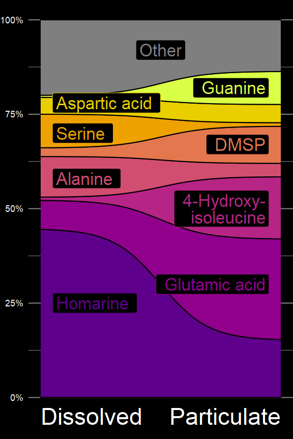

```{r setup, include=FALSE}
knitr::opts_chunk$set(echo = TRUE)
```

## REPRODUCIBILITY NOTE:

This figure requires a custom library that's published on Github but NOT on CRAN. The `ggbarribbon` library is one I wrote for the Ingalls Lab and can be found at https://github.com/IngallsLabUW/ggbarribbon. Installation should be done via the `devtools` package with the below code:

```
devtools::install_github("https://github.com/IngallsLabUW/ggbarribbon")
```

## Motivation

This is a figure that I made for my ARCS poster, presented on May 1st 2022. It's often difficult to get the data all shaped exactly the way we want it to and there's several `tidyverse` tricks that I thought would be worth documenting.

Also, this gave me a chance to show off the `ggbarribbon` library that I made a while ago to create nice curvy interpolations between points as a pseudo-alluvial plot.

## Tricks used

Again, nothing super magical in this one - mostly just a bunch of ggplot2 hacks. Lots of manual labelling with `scale_*_manual` and manual specification of label coordinates.

  - `ggbarribbon`'s `geom_bar_ribbon`
  - `scales::label_percent()` for percentages
  - Passing `hjust` as an *aesthetic* to left justify text on left side and right justify text on right side
  - The absolute maximum of `theme()` commands to fine-tune parameters


## Data

Data were passed off to me from Josh via Slack, so I don't have a lot of details about the collection/integration methods themselves. `Heal_G1_data` is originally from Katherine's Gradients 1 data but (I think) has been significantly shaped. Originally integrated in Skyline? `CX_EnviroConc_supptable6` comes from Josh's cation-exchange dissolved manuscript (in prep as of April 2022). Originally integrated in Skyline as well, I believe. I only end up using the ALOHA data from both of these.

## Output


