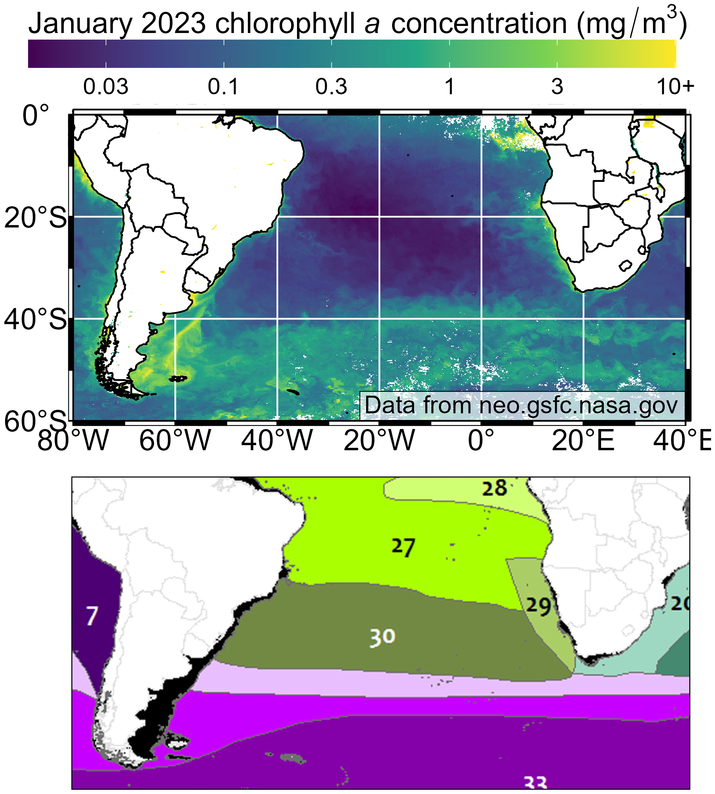

```{r setup, include=FALSE}
knitr::opts_chunk$set(echo = TRUE)
```

## Motivation

Maps are hard and chlorophyll maps are especially hard - the data comes down in
mostly weird formats, shapefiles are awful, and switching between images/data/
plots is always awkward at best. Anitra showed me a version of this plot made
in ODV that didn't have the chlorophyll data and instead showed the bathymetry,
which isn't as useful. So I remade it instead.

## Tricks used

  - Some `data.table` skills, especially the `:=` operator, `fread` from a URL, and
piping between commands
  - Clever use of `pmin` to set a max chlorophyll value, if I do say so myself
  - `geom_path(aes(x=long, y=lat, group=group), data=map_data("world"))` to get
an easy world map for the background? Amazing. Does require the `maps` package
invisibly though.
  - `cowplot::get_legend` to do fancy legend formatting without interfering
with `ggnewscale`
  - A complicated `expression` chain to get italics and superscripts in the plot title
  - Lots of `magick` skills
    - `image_append` to paste the legend, plot, and ecoregions together
    - `image_blank` to create a spacer when the borders didn't work out 
    - Lots of geometry specifications that I Googled on the fly


## Output


