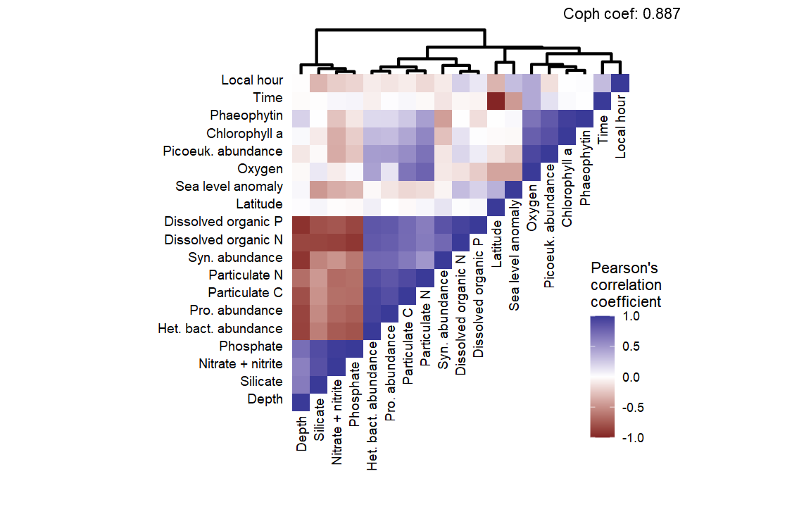

Heatmaps and dendrograms and ggplot, oh my
================
William Kumler
9/13/2022

## Motivation

I’ve struggled a couple times now to create a nice correlation heatmap
that aligns neatly with a clustering dendrogram. Most of my solutions
have been finicky, manually-aligned, and problematic. Also, most of the
existing options don’t have the fine control I want - for example,
removing the unnecessary lower half of the correlation matrix because
`cor()` is symmetric.

This one requires the ggdendroplot library which isn’t on CRAN but can
be installed with

    devtools::install_github("nicolash2/ggdendroplot")

## Tricks used

-   The `ggdendroplot` library for rendering an aligned dendrogram in
    ggplot space
-   Fancy level factoring
-   Filtering factors where one is less than the other to get only the
    bottom half of a heatmap
-   `annotate` with `hjust = 1` and `vjust = 1` to put a cophrenetic
    coefficient in the top right corner
-   `12*0.8/ggplot2::.pt` to get `geom_text` size to match axis labels
    -   This eventually became unnecessary because I remade the y-axis
        labels anyway but it’s a neat hack so I’m keeping it in

## Data

Data is the MESOSCOPE metadata, cleaned up for my manuscript and copied
over directly

## Output

