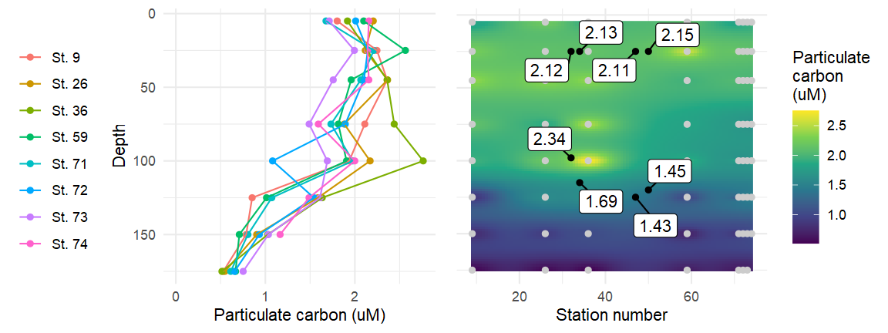

2D interpolation with manual inverse distance weighting
================
William Kumler
5/3/2022

## Motivation

Inverse distance weighting is a neat trick for interpolating or gridding
data that doesn’t already come in a nice format. I ran into this issue
when trying to get particulate carbon values for my metabolite data -
the stations/CTDs they were collected on didn’t overlap exactly and I
wanted some kind of interpolated signal to use. I’ve edited the station
numbers slightly (subtracted 30) to make this demo work - in reality,
metabolite samples were taken at stations 77 and 80 which are beyond the
range of the data here so I’ll actually use the mean value for a given
depth in the publication, but it still makes a nice demo.

## Tricks used

-   The 2D interpolation itself is the main trick here - I’ve manually
    coded it rather than using external libraries (and should therefore
    be used with caution). The function expects two data frames: 1) a
    “predictor” or “known” data frame with known values in the third
    column and coordinates in the first two and 2) an “unknown” data
    frame that just contains coordinates with the same names as the
    predictor dataset. The function returns the “unknown” data frame
    with a third column consisting of the predicted values in a new,
    third column. It also handles a missing “unknown” dataset by
    returning a grid of data spanning the range of the known data set
    with an interpolation resolution of 100. I use this first method to
    get the PC values for each metabolite point that become the labels
    and the second method to produce the background color scheme.
-   `ggrepel`’s `geom_label_repel`
-   `gridExtra`’s `grid.arrange` to put plots side-by-side
-   More `ggplot2` things
    -   Renaming factors on the fly for the `St. #` format
    -   Rounding within the `aes` call to make labels human-friendly
    -   `\n` within legend title to spread it across multiple lines
    -   `geom_path` instead of `geom_line` to respect y-axis order
        instead of x-axis order
    -   Using `xlim(0, NA)` to use the calculated maximum but ensure
        zero is included

## Data

Data comes from the Karl lab as part of the SCOPE collaboration and can
be downloaded from the website
[here](http://scope.soest.hawaii.edu/collaborators/datainventory/Data/Karl/Karl_FK_Nutrients_Final.xlsx)
but requires access so I’ve pulled out the relevant bit for the demo.
It’s then reshaped into long format using the snippet below:

``` r
clean_pcn <- "Karl_FK_PCPN_WC_current.xlsx" %>%
  readxl::read_excel(skip=1) %>%
  slice(-1:-2) %>% 
  filter(is.na(Comments)) %>%
  mutate(station=as.numeric(str_extract(Name, "(?<=FK-)\\d+"))) %>%
  select(station, depth=`Depth (m)`, PC_um=`C value (µmol/L)`)
write.csv(clean_pcn, "falkor_pcn_data.csv", row.names = FALSE)
```

## Output


