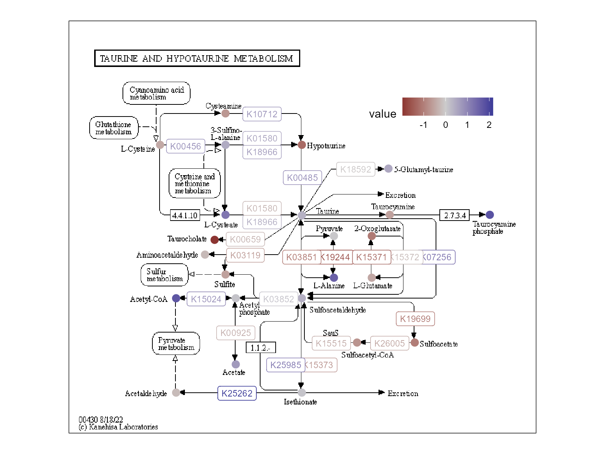

```{r setup, include=FALSE}
knitr::opts_chunk$set(echo = TRUE)
```

## Motivation

KEGG has a lot of super nice visuals for various pathways but they're difficult to edit/modify/access. I'm adding this codfish because I sat down and wrote some code to pull down various bits of info from KEGG and produce the pathway visuals and I don't want to lose it somewhere else. This code is strongly inspired by the [`pathview` package](https://bioconductor.org/packages/release/bioc/vignettes/pathview/inst/doc/pathview.pdf) but I didn't like how `pathview` 1) forcibly wrote files out into the working directory and 2) made it difficult to have complete control over the plot produced.

## Tricks used

  - Manual API calls to KEGG for
    - Pathway image
    - Pathway XML file for image coordinates
  - KEGGREST API calls
    - Individual metabolite information (exact masses, not shown in this demo)
    - KEGGREST has a really nice set of functions for parsing the XML returned
  - Raster things with ggplot()
    - as.raster from bitmap
    - geom_raster for rendering
  - Some xml2 parsing of the KEGG kgml file

## Output


