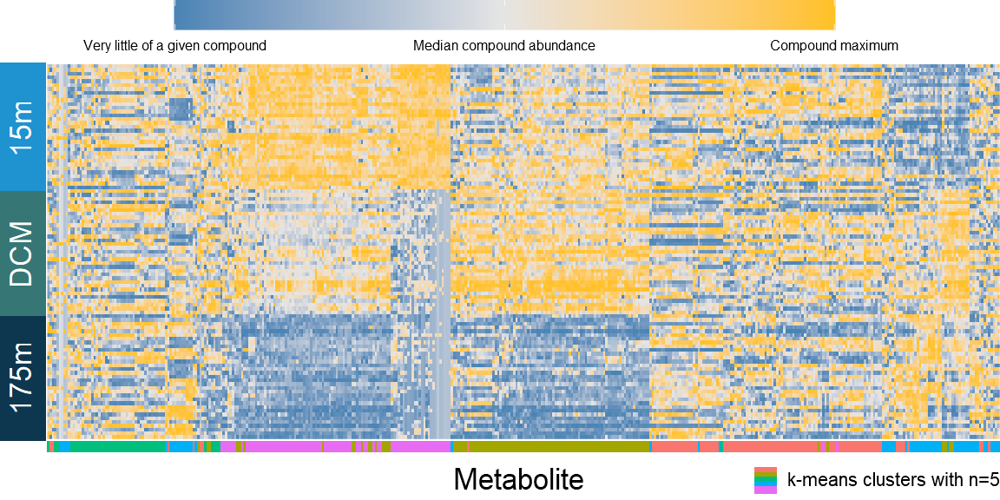

Plotting heatmaps with ggplot
================
William Kumler
2/16/2022

## Motivation

Metabolomics sometimes involves looking at lots and lots of compounds,
so what better way to do that than with a heatmap? Especially if the
compounds can be clustered so that clear trends with an organizing them
are visible. `pheatmap` does this reasonably well but doesn’t give me
the fine control I’d like, so instead I’ve recreated those heatmaps in
ggplot.

## Output

