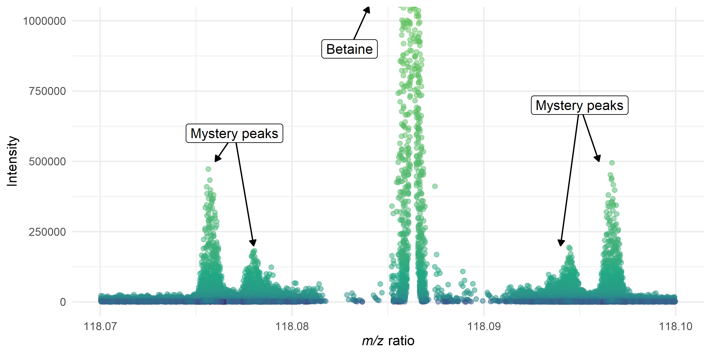

```{r setup, include=FALSE}
knitr::opts_chunk$set(echo = TRUE)
```

## Motivation

Sometimes MS data is just too complicated and it's necessary to check out the data in as raw of a form as possible. This means profile mode data, and that means using some tricks to crack open the MS data file. I ran into this issue when we were noticing that our Orbitrap was creating strange "echo" peaks around its base mass and I couldn't tell whether this was due to centroiding or some other process.

## About the data

This file is an example, with the original much much too large to be hosted on GitHub (nearly a gigabyte!). So it was minified using `RaMS`. After minification using 118.0865 as the base mass and a ppm error of 50, the file size was ~8MB. To shrink it even further, it was converted to .tmzML, which got it down to a file size of a 1.1MB. This step is NOT perfectly reproducible unless you have the original file, so I'm describing these steps here.

```{r, eval=FALSE}
library(RaMS)
minifyMSdata("200605_Smp_GBTFate1MT0-pos_A.mzML", mz_include=118.0865, ppm = 150,
             warn = FALSE, prefilter = 1, verbosity = 2)
tmzmlMaker("200605_Smp_GBTFate1MT0-pos_A_mini.mzML", verbosity=2)
```

## Output


