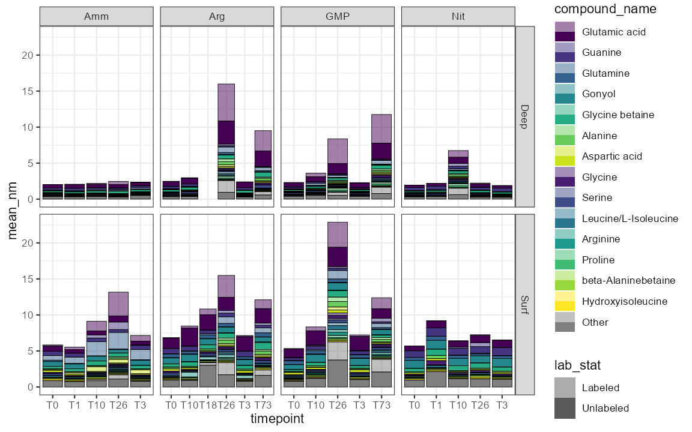

```{r setup, include=FALSE}
knitr::opts_chunk$set(echo = TRUE)
```

## Motivation

`ggplot2` is a nice library but sometimes things get a little finicky to work with the legends and summarizing across multiple areas isn't always the easiest. Here I was working with isotope-labeled data and wanted (basically) to have my `ggtintshade` library working so I could color by compound and shade by isotope. No luck, so here's a temporary hacky version.

## Tricks used

  - Basically just some clever redefinition of the key_glyph in ggplot2
  - Also some nice reminders of the summary steps for multiple compounds
  - The `splividis` function for extra color distinction

## Data

Data here is from the PARAGON project (https://github.com/wkumler/PARAGON) looking at isotope-labeled compounds in the marine environment

## Output


